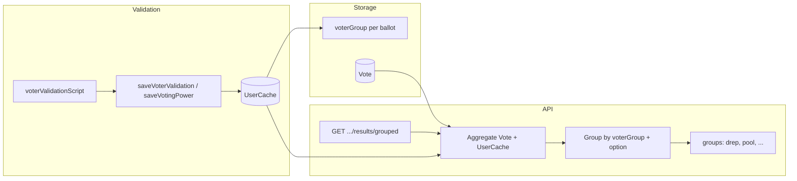

# Add Voter Groups for Results by Group

## Current architecture

- **Voter identity**: There is no Voter collection; `userId` is a string (e.g. wallet address or DRep key) used across [Vote](schema/Vote.js), [UserCache](schema/UserCache.js), [Session](schema/Session.js), etc.
- **UserCache** ([schema/UserCache.js](schema/UserCache.js)): One document per `(ballotId, userId)` with `validated` and `votingPower`. Populated when a voter is validated (login or first vote); validation is delegated to ballot's `voterValidationScript` (e.g. [voterValidationDReps.js](config/voterValidationDReps.js), [voterValidationPoolsStake.js](config/voterValidationPoolsStake.js)).
- **Results**: Proposal results are read from [Result](schema/Result.js) (cron [10minAggregateVotes.js](crons/10minAggregateVotes.js)) or computed on-the-fly in [routes/api/v0/proposals.js](routes/api/v0/proposals.js) (`GET .../results`): aggregate Votes, join UserCache, group by `submittedVote` (see [docs/submittedVote-vs-submittedValue.md](submittedVote-vs-submittedValue.md)); cron uses `$unwind` on `submittedVote`, proposals route groups by first element.

To support **results separated by voter group**, each voter must have a group for a ballot, and aggregations must group by that group as well as by vote option.

---

## 1. Schema: add `voterGroup` to UserCache

**File:** [schema/UserCache.js](schema/UserCache.js)

- Add optional field `voterGroup: { type: String, default: "default" }`. This stores the group for that voter on that ballot (e.g. `"drep"`, `"pool"`, `"default"`).
- Add composite index `{ ballotId: 1, voterGroup: 1 }` for efficient aggregation by ballot and group.
- Keep existing indexes.

**Backward compatibility:** Existing documents without `voterGroup` are treated as `"default"` in queries (use `$ifNull: ["$voterGroup", "default"]` in aggregations).

---

## 2. Helper: persist `voterGroup` in voter validation

**File:** [helper/voterValidation.js](helper/voterValidation.js)

- **saveVoterValidation(userId, ballotId, validated, voterGroup?)**: Add optional 4th argument `voterGroup`; include it in the `findOneAndUpdate` update object when provided.
- **saveVotingPower(userId, ballotId, votingPower, voterGroup?)**: Add optional 4th argument `voterGroup`; include it in the update object when provided.

---

## 3. Validation scripts: pass group name when saving

Each validation script passes a stable group id when calling `saveVoterValidation` / `saveVotingPower`:

| Script | voterGroup |
|--------|------------|
| voterValidationDReps.js | `"drep"` |
| voterValidationPoolsPledge.js | `"pool"` |
| voterValidationPoolsStake.js | `"pool"` |
| voterValidationPoolsVotingPower.js | `"pool"` |
| voterValidationAlwaysTrue.js | `"default"` |
| voterValidationAlwaysFalse.js | `"default"` |
| voterValidationSnapshot.js | `"default"` |

---

## 4. API: results by voter group

**Endpoint:** `GET /api/v0/proposals/:proposalId/results/grouped`

- **Middleware:** Use `getProposal` so invalid/missing `proposalId` returns 404.
- **Route order:** Register this route before `GET /:proposalId/results` so `results/grouped` is matched.
- **When `Result.resultsByGroup` exists:** Return it; map stored `id` to `value` and `label` from `proposal.voteOptions`, include `totalVotes` per group.
- **Fallback:** On-the-fly aggregation: same pipeline as cron (Vote + UserCache lookup, `$unwind` on `submittedVote`), add `voterGroup: { $ifNull: ["$voterData.voterGroup", "default"] }`, group by voterGroup and vote value; include abstain per group when `proposal.abstainAllowed`. Only include groups that have at least one vote.
- **Response shape:** `{ proposalId, groups: { "<voterGroup>": { results: [{ value, label, count, votingPower }], totalVotes }, ... } }`.
- **Vote field:** Use `submittedVote` only. Mirror the cron: `$unwind` on `submittedVote`, group by voterGroup and vote value.
- **Stored vs response:** Cron stores `id`; API returns `value` and `label` from `proposal.voteOptions`.

---

## 5. Cron and stored results by group (5B)

**Schema – [schema/Result.js](schema/Result.js):** Add optional `resultsByGroup: { type: Object }`. Structure: one key per voterGroup, each value `{ results: [{ id, label, count, votingPower }, ...], totalVotes }`.

**Cron – [crons/10minAggregateVotes.js](crons/10minAggregateVotes.js):** After computing overall `results`: run a second aggregation (Vote + UserCache lookup, `$unwind` on `submittedVote`), add `voterGroup: { $ifNull: ["$voterData.voterGroup", "default"] }`, group by voterGroup and vote value; include abstain per group when `proposal.abstainAllowed`. Build `resultsByGroup` (only groups with at least one vote). Write both `results` and `resultsByGroup` in the same `Result.updateOne`.

**API:** If `Result.resultsByGroup` exists, return it (map stored `id` to `value`/`label`); else run on-the-fly aggregation.

---

## 6. OpenAPI and tests

- **docs/openapi.yaml**: Document `GET /proposals/:proposalId/results/grouped` (response: `groups` as object of group key to `{ results, totalVotes }`).
- **Tests:** Consider adding or updating tests for the grouped endpoint and for aggregation by voterGroup.

---

## 7. Data flow summary

---

## 8. Files touched

| Area | File | Change |
|------|------|--------|
| Schema | schema/UserCache.js | Add voterGroup, index (ballotId, voterGroup) |
| Helper | helper/voterValidation.js | Optional voterGroup in saveVoterValidation and saveVotingPower |
| Config | All active config/voterValidation*.js | Pass group string when calling save functions |
| API | routes/api/v0/proposals.js | New route GET .../results/grouped |
| Docs | docs/openapi.yaml | Document new endpoint |
| Cron | crons/10minAggregateVotes.js | Compute and write resultsByGroup |
| Schema | schema/Result.js | Add optional resultsByGroup: Object |

---

## 9. Source of group names

**Voter groups are set only in the validation scripts in `config/`.** Each script chooses the group name and passes it when calling `saveVoterValidation` / `saveVotingPower`. There is no ballot-level config or admin UI for groups—the script is the single source of truth.
